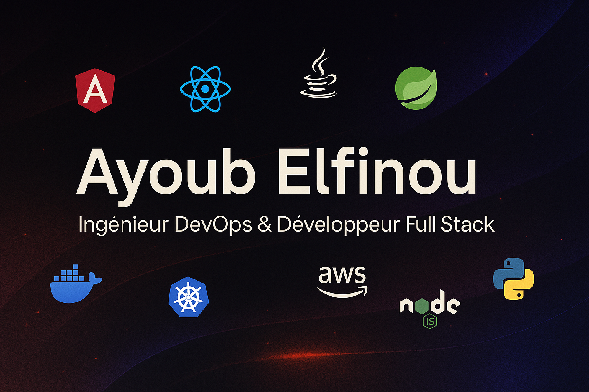

<h1 align="center">👋 Salut, c’est Ayoub Elfinou !</h1>

<h3 align="center"> Ingénieur DevOps & Développeur Full Stack | Automatisation, Cloud & Performance</h3>

  

  

---

## 🔥 À propos de moi

🎓 Diplômé de l’**École Nationale d’Ingénieurs de Brest (ENIB)**, je suis un **ingénieur DevOps et développeur full stack**, passionné par l’innovation, l’automatisation et les technologies Cloud.  
🧠 J’automatise les pipelines, optimise les déploiements, intègre la sécurité et assure la qualité continue du code.  
💡 Mon objectif : **rendre les processus plus rapides, fiables et scalables**, tout en gardant une approche humaine et collaborative.

---
## 🧭 Dernière mission

**Ingénieur DevOps – Secteur Assurance (Rouen)**  

- Développement et maintenance des **pipelines CI/CD** sous **Azure DevOps**.  
- Support aux équipes de développement pour la **livraison continue** et la **qualité logicielle**.  
- Gestion et supervision des environnements de développement, recette et production.  
- Intégration et maintenance des outils d’**observabilité et de monitoring** : **Prometheus**, **Grafana**, **Loki**, **Tempo**.  
- Automatisation des processus de déploiement et de contrôle qualité avec **SonarQube**, **Fortify**, **XL Deploy / XL Release**, **Artifactory**, **OpenShift** et **Kubernetes**.  
- Contribution à la **veille technologique** et à l’amélioration continue des pratiques DevOps au sein du projet.

  
## 💼 Mes compétences

### 🖥️ Frontend

### ⚙️ Backend

### ☁️ DevOps & Cloud

### 🧠 Autres skills

- **Sécurité & Qualité :** Fortify, SonarQube, OWASP  
- **Monitoring & Reporting :** Prometheus, Grafana, ELK Stack  
- **Low-Code / No-Code :** Appsmith, N8N  
- **Tests :** Postman, JUnit, Selenium  
- **Bases de données :** PostgreSQL, SQL Server, MongoDB 

---

## 🚀 Projets récents

| Projet | Description | Stack |
|--------|-------------|-------|
| 🧱 **App de modélisation pour architectes** | Conception et développement d’une application de modélisation basée sur le langage ArchiMate, en remplacement de la solution open-source Archi.| `ReactJS`, `NodeJS`, `D3.js`, `AWS`, `Typescript` |
| ⚙️ **Automatisation Low-Code**  |  développement et au déploiement d’une plateforme Low-Code / No-Code visant à accélérer la création d’applications métier tout en garantissant une sécurité et une scalabilité optimales. | `N8N`, `Appsmith`, `API REST`, 'AWS' |
| 🧠 **Détection de maladies par DEEP LEARNING** | Conception et développement d’une application capable d’identifier des maladies en analysant | `Python`, `TensorFlow`, `Keras`, `PySide` |
| 🌿 **Logiciel de caisse écoresponsable** | Développement d’un logiciel de caisse et d'un outil de gestion des ventes et des stocks optimisé pour une ferme écoresponsable | `AngularJS`, `Flask`, `Electron`, `PostgreSQL` |

---

## 📚 Sur ce profil GitHub

✨ Vous trouverez ici :

- Des projets full stack (perso et pro)
- Des snippets DevOps, automatisations
- Des ressources partagées & guides
- Une vitrine vivante de ma passion pour la tech

---

## 📬 Me contacter

📧 Email : **ayoub2000elfinou@gmail.com**  
🔗 LinkedIn : [ayoub-elfinou](https://www.linkedin.com/in/ayoub-elfinou-486578234/)  
📄 [Voir mon CV](https://drive.google.com/file/d/1W1a3hOPeToAZ7RGWvKzmmH0JlgGv5RiI/view?usp=sharing)

---

  

